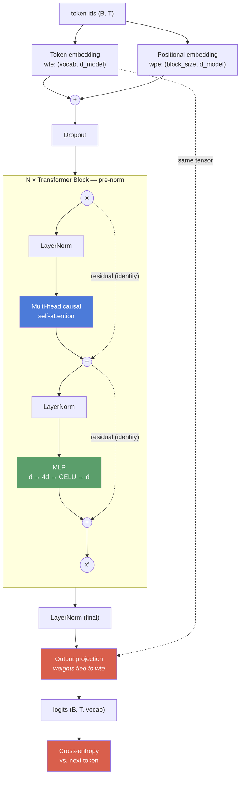
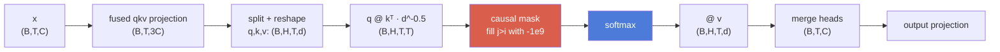

# Forge

A deep learning framework written from scratch on NumPy — a reverse-mode
autodiff engine, neural network primitives built on top of it, and a GPT-style
decoder-only Transformer that trains on real text and generates coherent output.

No PyTorch. No TensorFlow. No JAX. No autograd library. **Every gradient in this
repository is computed by an engine in [`forge/tensor.py`](forge/tensor.py), and
every layer is composed from ops that engine knows how to differentiate.**

```
loss 6.93 (uniform baseline)  ────────────►  {{FINAL_VAL}} validation
{{PARAMS}} parameters · {{LAYERS}} layers · {{HEADS}} heads · {{DMODEL}} d_model · {{CTX}}-token context
{{TESTS}} tests · {{GRADOPS}} operation configurations certified against finite differences
```

---

## What "from scratch" means here

The only numerical dependency is NumPy, used as an array library — `@`, `exp`,
`sum`, fancy indexing. Matplotlib draws one chart at the end. That is the whole
dependency list.

Everything below was built for this project:

| Layer | What it required |
|---|---|
| **Autodiff engine** | A `Tensor` that records a computation graph, a topological sort, and a hand-derived adjoint for each of its 26 operations |
| **Broadcasting gradients** | The adjoint of a broadcast is a sum over the stretched axes — applied inside every binary op |
| **Linear, Embedding, LayerNorm, Dropout** | Composed from certified primitives; the engine assembles their backward passes |
| **Multi-head causal self-attention** | Head splitting, scaled dot-product, causal masking, and the reshape/transpose gradient plumbing under it |
| **Adam** | Bias correction, decoupled weight decay, and the fused step-size algebra |
| **BPE tokenizer** | Byte-level merges with an incremental pair index |
| **Training loop** | Cross-entropy on the engine, global gradient clipping, warmup + cosine schedule, checkpointing |

### Why it's hard

**A wrong gradient still trains.** This is the thing that makes the project
genuinely difficult. If a layer's forward pass is wrong, shapes mismatch and the
program crashes. If a *gradient* is wrong, nothing crashes — the loss still goes
down, just to the wrong place, more slowly, and you cannot tell by looking. There
is no error message. This is why Phase 1 is built around a
[finite-difference gradient checker](forge/gradcheck.py) that certifies every
operation before anything is built on top of it, and why the checker is itself
tested against deliberately broken gradients (see below).

**Numerical stability is not automatic.** `exp` overflows above 88 in float32,
and attention logits routinely exceed that. `log(softmax(x))` underflows to
`-inf` for a confidently wrong prediction. Adam's first step is 3.16× too large
without bias correction. A framework hides all of this; here every instance had
to be found and handled, and each one is documented in the phase notes with the
reasoning.

**Memory is your problem.** The first full training run died at step 103 with an
out-of-memory error. The cause was not a leak in the ordinary sense but a
reference cycle: each backward closure captured its own output tensor, so
reference counting could never free a graph and every activation buffer survived
until the cyclic collector happened to run. Finding it meant profiling the graph
by operation and disabling the cyclic collector to make the failure deterministic.
[The full debugging story is in PHASE_5_NOTES.md.](PHASE_5_NOTES.md)

---

## Architecture



The dotted residual edges branch from the block's **input**, not from the
LayerNorm's output — that is exactly what makes the shortcut an identity and lets
gradient reach the first block undiminished.

Inside one attention block, for batch `B`, sequence `T`, width `C`, `H` heads of
size `d = C/H`:



**Key choices**, each with the reasoning in the phase notes:

- **Pre-norm** (`x + f(LayerNorm(x))`), not post-norm — the residual path stays an
  identity from the first block to the last, so gradient reaches early layers
  undiminished. Measured: the first block's gradient norm is within an order of
  magnitude of the last's across 6 layers.
- **Tied input/output embeddings** — saves `vocab × d_model` parameters and
  couples the two representations of a token. The tied tensor accumulates
  gradient from both uses and is stepped exactly once.
- **Residual projections initialized at `0.02/√(2·n_layer)`** — each block adds
  two branches into the residual stream, so without this the stream's variance
  grows linearly with depth.
- **Byte-level BPE** — no out-of-vocabulary case by construction. 2.43 characters
  per token vs. 1.00 for character-level, so a 128-token window sees ~311
  characters instead of 128.

---

## Results

**Corpus**: [tiny-shakespeare](https://raw.githubusercontent.com/karpathy/char-rnn/master/data/tinyshakespeare/input.txt),
1,115,394 characters, public domain. Tokenized to {{TOTAL_TOKENS}} BPE tokens
(vocab 1024), split {{TRAIN_TOKENS}} train / {{VAL_TOKENS}} validation.

| | |
|---|---|
| Parameters | **{{PARAMS}}** ({{PARAMS_NE}} non-embedding) |
| Architecture | {{LAYERS}} layers, {{HEADS}} heads, d_model {{DMODEL}}, d_ff {{DFF}}, context {{CTX}} |
| Training | {{STEPS}} steps × {{BATCH}} × {{CTX}} tokens = {{TOTAL_TRAINED}} tokens ({{EPOCHS}} epochs) |
| Uniform baseline | ln(1024) = **6.9315** |
| Final train loss | **{{FINAL_TRAIN}}** |
| Final val loss | **{{FINAL_VAL}}** |
| Best val loss | **{{BEST_VAL}}** |
| Wall clock | {{ELAPSED}} on CPU ({{SPS}} s/step) |


Both curves fall together and validation tracks training — {{VAL_COMMENT}}

### Generated text: before vs. after

Same prompt, same sampling settings (`temperature=0.8`, `top_k=40`), same seed.

**Step 0 — untrained** (loss ≈ 6.93, uniform over the vocabulary):

```
{{SAMPLE_EARLY}}
```

**Step {{MID_STEP}} — partially trained** (loss {{MID_LOSS}}):

```
{{SAMPLE_MID}}
```

**Fully trained** (val loss {{FINAL_VAL}}):

```
{{SAMPLE_FINAL}}
```

The full set across every checkpoint is in
[`samples/before_after.txt`](samples/before_after.txt).

---

## Verification

Correctness is the point of this project, so it is worth being specific about
what is actually checked. **{{TESTS}} tests**, run with `python -m pytest tests/`.

### The gradient checker (Phase 1)

Every operation's analytical gradient is compared against a central finite
difference, in float64, across random inputs and **random output projections** —
reducing with `out.sum()` only tests `Jᵀ·1`, which a transposed Jacobian can pass
by accident.

```
$ python scripts/gradcheck_report.py
{{GRADOPS}}/{{GRADOPS}} operation configurations certified   (rtol=1e-06, atol=1e-09, h=1e-5, float64)
typical relative error: ~2e-10
```

**The checker is itself tested against deliberately wrong gradients** — a 2×
error, a 1e-3 error, a 1e-5 error (10× the configured tolerance), and a 1% error
confined to *one entry of a 40-entry tensor*. All four are caught. A checker that
passes everything would have silently blessed the whole project.

### The things that fail silently

| Property | How it's tested |
|---|---|
| **LayerNorm normalizes** | Output mean `0 ± 1e-6`, variance `1 ± 1e-4` on deliberately badly-scaled input (σ=17, μ=42) — not just a shape check |
| **Causal masking blocks the future** | Attention weights are **exactly** `0.0` in the upper triangle; rewriting the input's tail leaves earlier outputs **bit-identical** with the tail scaled by 1000×; backpropagating from position `t` gives exactly zero gradient at every position after `t` |
| **...and the masking tests can fail** | A negative control zeroes the mask and asserts both tests detect the leak |
| **Adam's bias correction** | First step pinned to the closed form `lr·sign(g)` independent of gradient magnitude; the naive version overshoots by **3.16×**. Checked **bit-exact** against a separately written textbook Adam over 50 steps |
| **Gradients are right end-to-end** | The model overfits a single batch to loss < 0.05 from a `ln(V)` start — if any gradient in the stack were wrong, this stalls |
| **Every parameter is in the graph** | Each receives a finite, non-zero gradient; a missing one means a layer fell out of the graph |
| **Tokenizer round-trips** | `decode(encode(x)) == x` on the corpus, on whitespace and punctuation edge cases, on Unicode never seen in training, and on random byte soup |
| **No graph cycles** | No backward closure captures its output; 30 graphs are freed by refcounting with the cyclic collector disabled |

---

## Reproducing

Requires Python 3.11+ and about 1.3 GB of RAM.

```bash
git clone https://github.com/{{REPO}}.git
cd forge
pip install -r requirements.txt
```

**1. Verify the engine** (a few seconds — do this first; nothing else is
meaningful if it fails):

```bash
python -m pytest tests/ -q
python scripts/gradcheck_report.py
```

**2. Download the corpus and train the tokenizer** (~3 s):

```bash
python scripts/prepare_data.py --vocab-size 1024
```

**3. Train** (~{{ELAPSED_MIN}} minutes on a CPU):

```bash
python scripts/train.py --steps {{STEPS}} --dropout 0.2 --lr 3e-3
```

Writes `checkpoints/loss_curve.{csv,png}`, `run_summary.json`, and a checkpoint
every 250 steps. Seeded, so the run is reproducible.

**4. Generate**:

```bash
python scripts/generate.py --checkpoint checkpoints/final.npz --prompt "ROMEO:"
python scripts/generate.py --compare        # every checkpoint, early to final
```

The model geometry is configurable:

```bash
python scripts/train.py --n-layer 6 --n-head 8 --d-model 256 --block-size 256
```

---

## Repository layout

```
forge/
  tensor.py       Phase 1 — autodiff engine: Tensor, 26 ops, backward()
  gradcheck.py    Phase 1 — finite-difference certification
  nn.py           Phase 2 — Module, Linear, Embedding, LayerNorm, Dropout,
                            softmax, GELU, cross-entropy, causal self-attention
  optim.py        Phase 2 — Adam with bias correction, SGD, gradient clipping
  model.py        Phase 3 — GPTConfig, Block, GPT, generate()
  tokenizer.py    Phase 4 — byte-level BPE (+ character-level fallback)
  data.py         Phase 4 — DataLoader, train/val split, shuffled batching
  train.py        Phase 5 — LR schedule, checkpointing, evaluation, plotting
scripts/          prepare_data.py, train.py, generate.py, gradcheck_report.py
tests/            435 tests, one file per phase
PHASE_N_NOTES.md  What was verified in each phase, and the real tradeoffs
```

Each phase has its own notes file documenting what was verified and the
numerical and design decisions behind it — including the mistakes, which are
usually the more instructive part:

- [Phase 1 — Autodiff engine](PHASE_1_NOTES.md)
- [Phase 2 — NN primitives and Adam](PHASE_2_NOTES.md)
- [Phase 3 — Transformer architecture](PHASE_3_NOTES.md)
- [Phase 4 — Tokenizer and data pipeline](PHASE_4_NOTES.md)
- [Phase 5 — Training and generation](PHASE_5_NOTES.md)

---

## Known limitations

This is an educational and portfolio implementation, not a production system.
The gap is large and worth being precise about.

### Scale

{{PARAMS}} parameters against GPT-3's 175 billion — roughly **{{SCALE_FACTOR}}×
smaller**. Trained on ~1 MB of text; GPT-3 saw ~570 GB. The model learns
Shakespeare's *surface form* — speaker labels, line breaks, verse rhythm,
plausible word shapes — and some local grammar. It does not learn meaning, and
it will not hold a coherent thought across a paragraph. That is a consequence of
scale, not of a bug.

### Deliberately skipped optimizations

| Skipped | Why | What it costs |
|---|---|---|
| **KV-cache** | Generation recomputes keys and values for the entire prefix on every step. A cache would add a mutable state path through attention that complicates the from-scratch story for no learning value. | Generation is O(T²) per token instead of O(T) — the single largest optimization left |
| **Mixed precision** | float16 needs loss scaling to keep small gradients from flushing to zero, plus a master float32 copy of every parameter. Real engineering, but it is about GPU throughput, and there is no GPU here. | ~2× memory and bandwidth on hardware that supports it |
| **Multi-GPU / distributed** | NumPy is single-device by definition. Gradient all-reduce and sharding are a distributed-systems problem, not a deep-learning one. | Cannot scale past one machine |
| **Fused CUDA / flash attention** | Requires leaving NumPy entirely. | Attention materializes the full `(B,H,T,T)` matrix, so memory is quadratic in context |
| **Gradient checkpointing** | Would trade compute for memory by recomputing activations in the backward pass. Not needed at this scale. | Activation memory is linear in depth |
| **Learned LR schedules, RoPE, SwiGLU, RMSNorm** | Each is a small win over the GPT-2 baseline this reproduces. The goal was the canonical architecture, clearly. | Modestly better loss per parameter |

### Engine limitations

- **No in-place operations** and no version counter to detect a buffer mutated
  after being recorded on the tape.
- **No second derivatives** — the graph is not itself differentiable.
- **CPU only, float32.** A training step is dominated by matmul, and NumPy's BLAS
  reaches ~179 GFLOP/s here, which is close to what this CPU can do. There is no
  large algorithmic win left without changing hardware.
- **No special tokens** (`<bos>`/`<eos>`/`<pad>`). The model trains on one
  continuous stream, which suits a single work but not a multi-document corpus.
- **BPE training holds the corpus in memory** as Python objects. Fine at 1 MB;
  a multi-gigabyte corpus would need chunked counting.

### What is *not* in `.gitignore` and why

Checkpoint weights (`checkpoints/*.npz`) are excluded — they are tens of
megabytes, change completely every run, and make a repository permanently larger.
The training command and the fixed seed reproduce them. What *is* committed is
the evidence the run happened: `loss_curve.csv`, `loss_curve.png`,
`run_summary.json`, and the generated samples.

---

## License

MIT. The tiny-shakespeare corpus is public domain.
