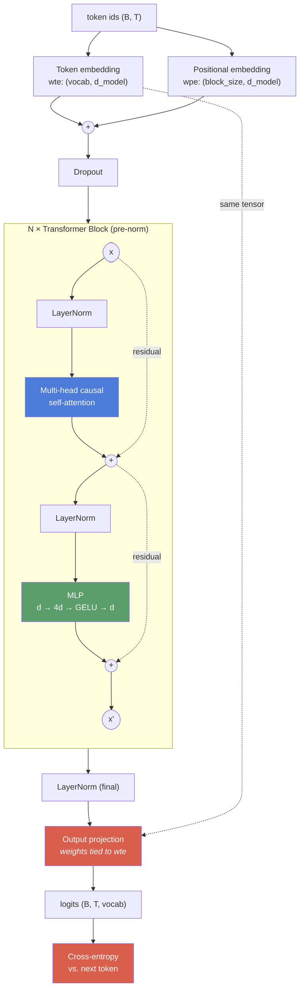
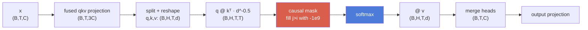
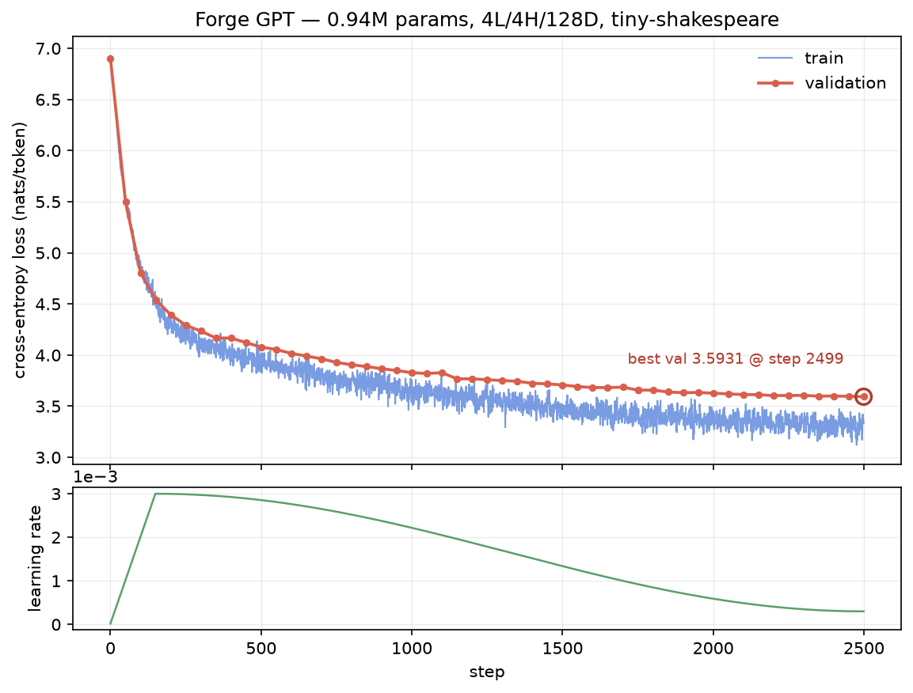

# Forge

A small deep learning framework written on top of NumPy: an autodiff engine, the
layers you need for a transformer, and a GPT that trains on Shakespeare and
generates text.

No PyTorch, TensorFlow, JAX, or autograd. Every gradient comes from
[`forge/tensor.py`](forge/tensor.py), and every layer is built from ops that
engine can differentiate.

```
uniform baseline  ln(1024) = 6.9315
final             train 3.0967   val 3.5931
model             940,800 params · 4 layers · 4 heads · d_model 128 · 128-token context
tests             436 passing · 31 op configurations gradient-checked
```

## What's actually built here

NumPy is used as an array library only: `@`, `exp`, `sum`, fancy indexing.
Matplotlib draws one chart. That's the whole dependency list.

Everything else is in this repo:

- **Autodiff engine.** A `Tensor` that records a graph, a topological sort, and a
  hand-written adjoint for each of its 26 ops. Broadcasting included, since the
  adjoint of a broadcast is a sum over the stretched axes.
- **Layers.** Linear, Embedding, LayerNorm, Dropout, GELU, softmax,
  cross-entropy, and multi-head causal self-attention.
- **Adam**, with bias correction and decoupled weight decay.
- **A byte-level BPE tokenizer** with an incremental pair index.
- **Training loop** with gradient clipping, warmup + cosine decay, and
  checkpointing.

### Why this is harder than it looks

A wrong gradient still trains. If a forward pass is wrong you get a shape error
and a stack trace. If a *gradient* is wrong you get nothing: the loss still goes
down, just slower and to a worse place. Nothing crashes and there is no error
message. That's why Phase 1 is built around a
[finite-difference gradient checker](forge/gradcheck.py) that certifies every op
before anything is built on top, and why the checker is itself tested against
gradients that are deliberately broken.

Numerical stability isn't free either. `exp` overflows above 88 in float32 and
attention logits go past that routinely. `log(softmax(x))` underflows to `-inf`
the first time the model is confidently wrong. Adam's first step is 3.16x too big
without bias correction. A framework handles all of this for you; here you find
each one yourself, usually the hard way.

Memory is also your problem. The first full training run died at step 103 with an
OOM. It wasn't a leak in the usual sense: each backward closure captured its own
output tensor, so every node sat in a reference cycle that refcounting can't
break, and whole graphs survived until the cyclic collector happened to run.
Details in [PHASE_5_NOTES.md](PHASE_5_NOTES.md).

## Architecture



Note the residual edges start at the block *input*, not at the LayerNorm output.
That's what keeps the shortcut an identity.

Inside one attention block (batch `B`, sequence `T`, width `C`, `H` heads of size
`d = C/H`):



A few choices worth calling out, with the reasoning in the phase notes:

- **Pre-norm**, `x + f(LayerNorm(x))`. With post-norm the shortcut isn't an
  identity and gradient gets rescaled once per block. Measured across 6 layers,
  the first block's gradient norm stays within an order of magnitude of the last's.
- **Tied embeddings.** The output projection is the token embedding transposed.
  Saves `vocab × d_model` params, and the tied tensor gets gradient from both uses
  while being stepped once.
- **Residual projections init at `0.02/√(2·n_layer)`.** Two branches per block
  feed the residual stream, so without this its variance grows with depth.
- **Byte-level BPE**, so there's no OOV case at all. 2.43 chars/token against 1.00
  for character-level, which means a 128-token window covers ~311 characters.

## Results

Corpus is [tiny-shakespeare](https://raw.githubusercontent.com/karpathy/char-rnn/master/data/tinyshakespeare/input.txt),
1,115,394 characters, public domain. Tokenized to 459,760 BPE tokens at vocab
1024, split 413,784 train / 45,976 val.

| | |
|---|---|
| Parameters | 940,800 (793,344 non-embedding) |
| Architecture | 4 layers, 4 heads, d_model 128, d_ff 512, context 128 |
| Training | 2500 steps × 32 × 128 = 10.2M tokens (24.7 epochs) |
| Uniform baseline | ln(1024) = 6.9315 |
| Final train / val | 3.0967 / 3.5931 |
| Wall clock | 1h59m on CPU, 2.87 s/step |



Validation hits its minimum on the last step and never turns back up, so the run
was bounded by the step budget rather than by overfitting. Train and val separate
by about 0.50 nats, which is roughly what you'd expect passing over a 400k-token
corpus 25 times with dropout 0.2 and weight decay 0.1.

### Before and after

Same prompt, same sampling settings (`temperature=0.8`, `top_k=40`), same seed.

Step 0, untrained:

```
ROMEO::�asseak� upAU youAB)usareimRO pray housele enwnroV thoughtinin Cloneone hon- wordat� alTis� hath so life lifeorabwnwnigh sw Y friends�eeterter� whenam bet thisestTheYou^� en been son EDWARD�ee� princeLILI ru bearTH8 meW[�Here'sim knLEtheYour�LO hor offore wellThou death death hathhe'd�That
```

Step 1000, val loss 3.83:

```
ROMEO:
I would not, my lord, formand.

ROMEO:
What is the tears.

KING RICHARD III:
Marry of the king, with thy cold to thee?

JULIET:
Provost.

DUCHESS OF YORK:
Ay, if you hear me to live to see
I doubly, I will make them?
```

Fully trained, val loss 3.5931:

```
ROMEO:
I say you, my lord, is a care;
But how I was not wapp'd to see my grieed.

JULIET:
I would not a words be so; for this!

ROMEO:
I should be not to do; I would have not stay,
I cannot do not stay with thee, I less, I have,
As when he not be your tender draitor.

Nurse:
I, though though I hadst be want;
Where is this day as thou art thou wilt belielden a sad,
Had he not for the wounds, and chast thy wit's foison,
Which, thou be so greater, wonder why, sounds,
And if thou wilt dost hear
And what thou shalt know'st not the seasure.
```

Every checkpoint's output is in [`samples/before_after.txt`](samples/before_after.txt).

## Verification

436 tests, `python -m pytest tests/`.

### Gradient checking

Each op's analytical gradient is compared against a central finite difference in
float64, over random inputs and random output projections. The projections matter:
reducing with `out.sum()` only ever tests `Jᵀ·1`, which a transposed Jacobian can
pass by luck.

```
$ python scripts/gradcheck_report.py
31/31 operation configurations certified   (rtol=1e-06, atol=1e-09, h=1e-5, float64)
typical relative error: ~2e-10
```

The checker also gets pointed at gradients that are wrong on purpose: 2x off,
1e-3 off, 1e-5 off (10x the tolerance), and 1% off in a single entry of a
40-element tensor. It catches all four. A checker that passes everything would
have quietly blessed the whole project.

### The things that fail silently

| Property | Test |
|---|---|
| LayerNorm normalizes | Output mean `0 ± 1e-6` and variance `1 ± 1e-4` on badly-scaled input (σ=17, μ=42), not just a shape check |
| Causal masking works | Attention weights are exactly `0.0` above the diagonal; rewriting the input's tail (scaled 1000x) leaves earlier outputs bit-identical; backprop from position `t` gives zero gradient past `t` |
| Those masking tests can fail | A negative control zeroes the mask and checks both tests detect the leak |
| Adam's bias correction | First step pinned to `lr·sign(g)` regardless of gradient magnitude; the naive version overshoots 3.16x. Also matched bit-for-bit against a separately written textbook Adam over 50 steps |
| Gradients work end to end | The model overfits one batch to loss < 0.05 from a `ln(V)` start. Any wrong gradient in the stack and this stalls |
| No layer fell out of the graph | Every parameter gets a finite, non-zero gradient |
| Tokenizer round-trips | `decode(encode(x)) == x` on the corpus, on whitespace and punctuation, on Unicode never seen in training, and on random byte soup |
| No graph cycles | No backward closure captures its output; 30 graphs freed by refcounting with the cyclic collector off |

## Running it

Python 3.11+, about 1.3 GB of RAM.

```bash
git clone https://github.com/harshpatelhp066-del/forge.git
cd forge
pip install -r requirements.txt
```

Verify the engine first. Takes a few seconds, and nothing else means anything if
it fails:

```bash
python -m pytest tests/ -q
python scripts/gradcheck_report.py
```

Get the corpus and train the tokenizer (~3s):

```bash
python scripts/prepare_data.py --vocab-size 1024
```

Train (about two hours on a CPU):

```bash
python scripts/train.py --steps 2500 --dropout 0.2 --lr 3e-3
```

That writes `checkpoints/loss_curve.{csv,png}`, `run_summary.json`, and a
checkpoint every 250 steps. It's seeded, so it reproduces. Add
`--resume checkpoints/step_001750.npz` to pick up an interrupted run.

Generate:

```bash
python scripts/generate.py --checkpoint checkpoints/final.npz --prompt "ROMEO:"
python scripts/generate.py --compare        # every checkpoint, early to final
```

Geometry is configurable:

```bash
python scripts/train.py --n-layer 6 --n-head 8 --d-model 256 --block-size 256
```

## Layout

```
forge/
  tensor.py       autodiff engine: Tensor, 26 ops, backward()
  gradcheck.py    finite-difference certification
  nn.py           Module, Linear, Embedding, LayerNorm, Dropout, softmax,
                  GELU, cross-entropy, causal self-attention
  optim.py        Adam, SGD, gradient clipping
  model.py        GPTConfig, Block, GPT, generate()
  tokenizer.py    byte-level BPE, plus a character-level fallback
  data.py         DataLoader, train/val split, shuffled batching
  train.py        LR schedule, checkpointing, evaluation, plotting
scripts/          prepare_data.py, train.py, generate.py, gradcheck_report.py
tests/            436 tests, one file per phase
```

Each phase has notes covering what was verified and the decisions behind it,
including the things that went wrong:

- [Phase 1 — Autodiff engine](PHASE_1_NOTES.md)
- [Phase 2 — NN primitives and Adam](PHASE_2_NOTES.md)
- [Phase 3 — Transformer architecture](PHASE_3_NOTES.md)
- [Phase 4 — Tokenizer and data pipeline](PHASE_4_NOTES.md)
- [Phase 5 — Training and generation](PHASE_5_NOTES.md)
- [Phase 6 — Polish and delivery](PHASE_6_NOTES.md)

## Limitations

This is a learning project, not a production system, and the gap is big.

Scale. 940,800 parameters against GPT-3's 175 billion, so about 186,000x
smaller, trained on ~1 MB against ~570 GB. It picks up Shakespeare's surface form
(speaker labels, verse rhythm, archaic grammar, plausible word shapes) and some
local grammar. It doesn't learn meaning and won't hold an idea across a paragraph.
Look at the samples above and you can see exactly that: correct structure,
invented words like "draitor" and "seasure".

Things I skipped, and what they'd have cost:

| Skipped | Why | Cost |
|---|---|---|
| KV-cache | Adds a mutable state path through attention for no learning value | Generation is O(T²) per token instead of O(T). Biggest win left on the table |
| Mixed precision | float16 needs loss scaling and a master float32 copy. It's a GPU throughput technique and there's no GPU here | ~2x memory and bandwidth where supported |
| Multi-GPU | NumPy is single-device. All-reduce and sharding are a distributed systems problem, not a DL one | Can't scale past one machine |
| Flash attention | Needs to leave NumPy | Attention materializes the full `(B,H,T,T)` matrix, so memory is quadratic in context |
| Gradient checkpointing | Not needed at this scale | Activation memory is linear in depth |
| RoPE, SwiGLU, RMSNorm | Wanted the canonical GPT-2 architecture, clearly | Slightly better loss per parameter |

Engine limits. No in-place ops and no version counter to catch a buffer
mutated after being taped. No second derivatives. CPU and float32 only. No special
tokens, so the model trains on one continuous stream, which is fine for a single
work and wrong for a multi-document corpus. BPE training holds the corpus in
memory, fine at 1 MB and not at 1 GB.

On the checkpoint weights. `checkpoints/*.npz` is gitignored: eleven
checkpoints at ~11 MB each, completely different every run, and a binary in git
history is there forever. The training command and the fixed seed reproduce them.
What is committed is the evidence, `loss_curve.csv`, `loss_curve.png`,
`run_summary.json` and the generated samples, which keeps the repo at 657 KB.

## License

MIT. The tiny-shakespeare corpus is public domain.
